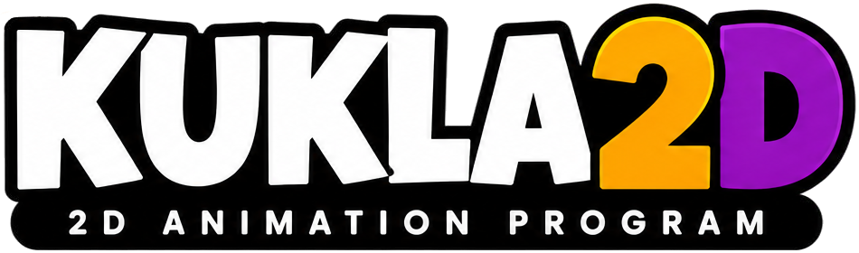
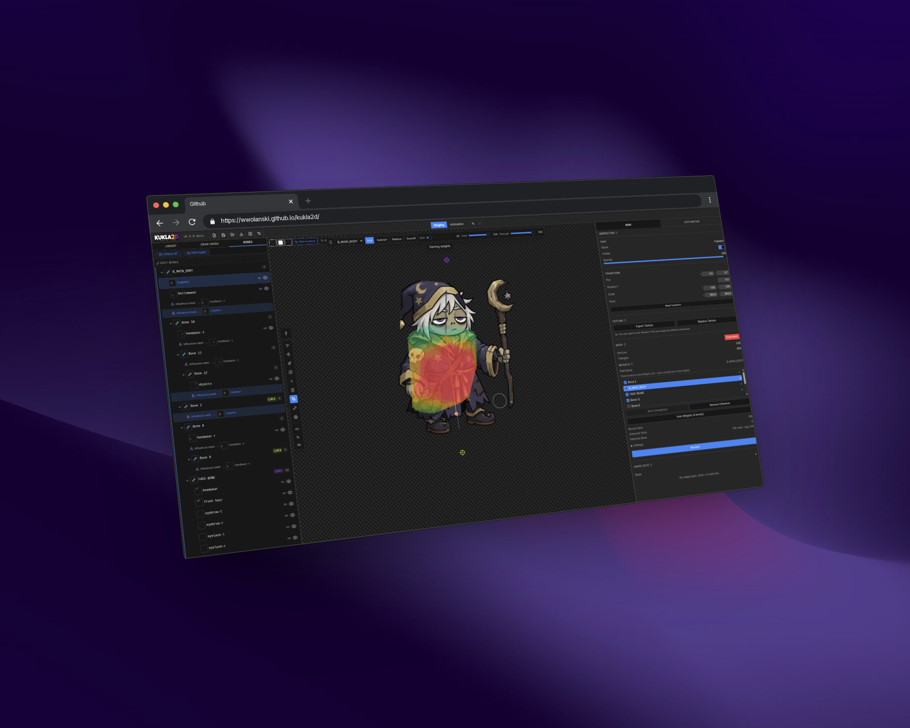

# Kukla2D



<p align="center">
  <a href="https://github.com/wwolanski/Kukla2D/actions/workflows/ci.yml"></a>
  
</p>

<h3 align="center">🌐 &nbsp;<a href="https://wwolanski.github.io/Kukla2D">TRY IT LIVE</a>&nbsp; 🚀</h3>


Kukla2D is a local-first, browser-based editor for rigging and animating 2D characters. It combines an approachable workflow with mesh deformation, skeletal animation, constraints, physics, and game-ready export.

>[!WARNING]
> ***Version 0.9.0-beta** — Kukla2D's core editing workflow, project save/load, and primary export formats are functional and suitable for regular use. Some features remain experimental, and minor bugs or performance issues may still occur.*

## Highlights

- **Import & organize:** PSD layers auto-converted to scene nodes; PNG drag-and-drop; tree library with folders, reordering, and inline rename. Supports external `.scml` project files (Spriter Pro)
- **Mesh & rig authoring:** alpha-contour mesh generation, brush/vertex editing, bone drawing with Smart auto-assignment, weight painting with color-coded heatmaps, blend shapes, and warp deformers — all directly on canvas.
- **10 interactive tools:** Select, Transform, Mesh Deform/Adjust, Add/Remove Vertex, Paint Weights, Pose Rig, Draw Bone, Draw IK — with shortcuts, staging/animation modes, and policy-enforced tool restrictions.
- **Animation timeline:** dopesheet with per-target tracks, draggable keyframes, custom cubic-bezier easing, pose clipboard with mirroring, auto-keyframe recording, and boomerang targets.
- **Constraints:** IK (single/two-bone with FK blend), transform copy (per-channel, local/world), and path constraints (multi-point bezier) — all with mix control.
- **Physics:** Verlet particle system with gravity, wind, damping, and distance constraints; pendulum chain generator; physics rules editor with tag filtering; offline baking to keyframes.
- **Project management:** `.kk2d` format with schema migrations (v0.1→9), Zod validation, IndexedDB library, thumbnail gallery, and crash recovery.
- **Export:** PNG sequences, spritesheets, and GIFs; [Phaser 4.2.1](https://phaser.io) baked texture atlas with `.atlas.json`, `.animations.json`, and TypeScript example; export area with preset resolutions. Experimental: Spine 4.0 JSON and Live2D Cubism 5.0.


## Screenshots



## Quick start

Requirements: Node.js `>=24.18.0 <25` and npm `>=11.17.0 <12`.

```bash
git clone https://github.com/wwolanski/Kukla2D.git
cd Kukla2D
npm ci
npm run dev
```

## Quality gates

```bash
npm run check          # types, lint, architecture, dead code, unit tests, build, bundle budget
npm run test:coverage  # enforced Vitest coverage thresholds
npm run test:e2e       # production build tested in Chromium
```

GitHub Actions runs these as separate quality, coverage, and E2E jobs. See [testing documentation](docs/testing.md) for focused commands.

## Architecture

Kukla2D uses feature-first modules around a pure domain/runtime core. [Zustand](https://github.com/pmndrs/zustand) owns document and durable UI state, [XState](https://github.com/statelyai/xstate) owns editor workflows, [Immer](https://github.com/immerjs/immer) patches power undo/redo, and [Zod](https://github.com/colinhacks/zod) validates persisted data.

```text
src/app             composition root
src/features        user-facing feature modules
src/domain          shared pure domain logic
src/runtime         animation, constraints, and physics evaluation
src/store           document, editor, and session state
src/platform        browser storage, resource lifecycle, and lazy adapters
packages            contracts, engine experiments, and format adapters
```

Start with the [documentation index](docs/README.md) and [architecture overview](docs/architecture/overview.md).

## Origin and attribution

Kukla2D began as a fork of [MangoLion/Stretchy Studio](https://github.com/MangoLion/stretchystudio). Its preserved MIT notice credits Nguyen Phan; the original copyright and license text remain in [LICENSE](LICENSE).

The current project retains and adapts several parts of that foundation:

- selected Radix/shadcn-style UI primitives, theme and preferences code, and parts of the original save/load screens;
- PSD parsing and organization concepts, mesh generation algorithms (contour sampling and Delaunay triangulation), and portions of the original transform and animation math, now typed and extended;
- portions of the Spine exporter and the experimental Live2D export toolchain, with both formats still treated as unsupported/experimental output.

Most application-level systems have since been replaced or substantially rebuilt:

- the custom WebGL renderer and DOM/SVG editing overlays were replaced by a [PixiJS 8](https://github.com/pixijs/pixijs) scene, interaction, picking, overlay, capture, and GPU-resource lifecycle;
- the flat component/store structure became feature-first modules with explicit application, domain, infrastructure, and public API boundaries;
- project state and file handling gained strict TypeScript contracts, Zod validation, a versioned migration chain, atomic workspace loading, IndexedDB autosave, and crash recovery;
- animation authoring and evaluation were expanded into a separate runtime covering skeletal posing, mesh skinning and warps, constraints, physics, timeline drafts, easing, audio sync, and deterministic export;
- the export pipeline now includes PNG sequences, spritesheets, GIF, and a [Phaser 4.2.1](https://phaser.io) atlas adapter verified by browser interoperability tests;
- the engineering baseline—strict TypeScript, architecture guards, unit/integration coverage, production-build E2E tests, CI, dead-code checks, and bundle budgets—was added for Kukla2D.

## License

[MIT](LICENSE)
